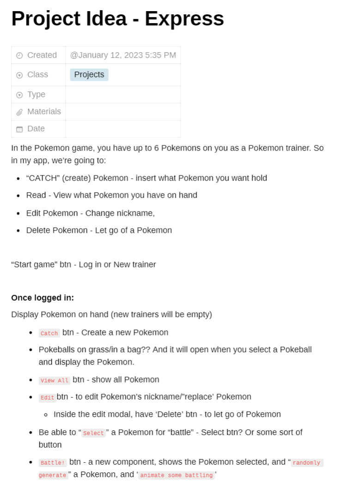

# Pokemon Mini Battler
The third project of the Software Engineering Immersive Course at General Assembly. This is a team project where the goal is to create a RESTful Single-Page Application(SPA) that will have CREATE, READ, UPDATE, and DELETE(CRUD) functionality. As our very first software development project, this task will be the perfect opportunity to experience what it will be like to work collaboratively in the real world. 

The theme we have chosen is Pokemon and it will be a smaller version of the classic game. As a user, the goal of the game is to win battles in order to evolve the Pokemon and then have the ability to attain more Pokemon to complete the Pokedex. 

**Team Members:**  
[Tina Vo](https://github.com/tinanvo) 
[Phil Wong](https://github.com/pwong-it) 
[Mitchell O'Brien](https://github.com/OB-CODE) 
[Harry Hwang]() 

Date Received: 16/01/23 
Date Due: 20/01/22

## :computer: [Click here]() to see the live project!

## :page_facing_up: About
The below are the criteria set out by the course that we will need to meet:
### Technical Requirements
The app that we are building must:
-   Craft thoughtful user stories together, as a team
-   Manage team contributions and collaboration using a standard Git flow on Github
-   Layout and style your front-end with clean & well-formatted CSS
-   Deploy your application online so it's publically accessible

### Necessary Deliverables (Minimum Viable Product)
-   A link to your hosted working app in the URL section of your Github repo
-   A team git repository hosted on Github, with a link to your hosted project, and frequent commits from every team member dating back to the very beginning of the project
-   A readme.md file with:
    -   Explanations of the technologies used
    -   A few paragraphs about the general approach you took
    -   Link to your user stories – who are your users, what do they want, and why?
    -   Link to your wireframes – sketches of major views / interfaces in your application
    -   Link to your diagrams - database schema
    -   Descriptions of any unsolved problems or major hurdles your team had to overcome

### Project Based MVP
-   Five Pokemon in the database
-   One Pokemon created as a starter upon Signup
-   CRUD functionality:
    -   CREATE
        -   Signing up Trainer
        -   Logging in Trainer (creating session)
    -   UPDATE
        -   Nicknames
        -   Evolving Pokemon - With enough Win Requirements
        -   Healing Pokemon - When Pokemon has finished a battle
        -   Trainer's Pokedex
    -   DELETE
        -   Releasing Pokemon 
-   A working battle system
    -   Attack until either your Pokemon or the opponent faints
    -   Pokemon stats utilised to determine battle (eg. speed determines who attacks first)
-   Visual HP bar display
-   Implement Evolution after meeting battle win requirement 

### Possible Additional Features
-   Integrate Pokemon Moves (different attacks)
-   Integrate Pokemon Type advantages/disadvantages (damage multipliers)
-   Pokemon Experience Points/Levels rather than win requirements for evolving
-   Incorporate Pokemon API to display full list of Pokemon (First Gen 150)
-   Healing Pokemon sound effect
-   Minor Battle Animations
 
## :pencil2: Planning & Problem Solving
### General Plan

*Initial Concept*

Wireframing / Conceptual Design of website  
  
*Team Concept Planning via Zoom*

  
*Wireframing Concept of MVP*

 
*Setting up Github Workflow* 

 
*Trello initial tasks* 

 
 
*Landing page options* 

Use the Problem Solving Process framework to break down the project into manageable components. From Technical Requirements & Necessary Deliverables
1.  Keywords 
    - Git Workflow
    - sign up & Login features
    - GET, POST, PUT/PATCH, DELETE routes
    - Wireframing or conceptual design evidence
    - Clean HTML/CSS

2.  Tasks  
    - :white_check_mark: Create homepage
    - :white_check_mark: Create database
    - :white_check_mark: Create Sign up page
    - :white_check_mark: Create Choose Starter Page
    - :white_check_mark: Create login page
    - :white_check_mark: Create Party Page
    - :white_check_mark: Create Pokedex Page
    - :white_check_mark: Create Battle Page
    - :white_check_mark: Users can battle Pokemon
    - :white_check_mark: Users can delete/release Pokemon
    - :white_check_mark: Users can heal Pokemon 

3.  Implement - Coding Journey and debugging.  
    Below are some "highlights" where problems arose and how I dealt with this problems.   

    ### Progress
    
    

    ### For further details and complete code of the app, please feel free to click into any of the files in the repo.  

## Post-Development

-   

## :rocket: Cool Tech Implemented
-   Trello - For project management
-   Whimsical - Wireframing
-   Canva - For Conceptual Design and graphics
-   JavaScript - Language used
-   Express - Framework
-   Bcrypt - Security
-   PostgreSQL - Relational Database Management System
-   Fly.io - To deploy full stack apps and databases
-   pokeapi.co - Pokemon API
-   Slack - Team collaboration
-   Photoshop - Image editing

### References
-   Classic Game Font- https://www.fontspace.com/pokemon-gb-font-f9621 
-   Pokemon Title Font - https://www.fontspace.com/category/pokemon
-   Background - https://icon54.com/free-pokemon-go-icons/
-   Modal Web Design - https://blog.hubspot.com/website/modal-web-design
-   

## :scream: Bugs to fix :bug:
- 
 

## :sunglasses: Lessons learnt
1.  

## :white_check_mark: Future features
-   

## Conclusions

